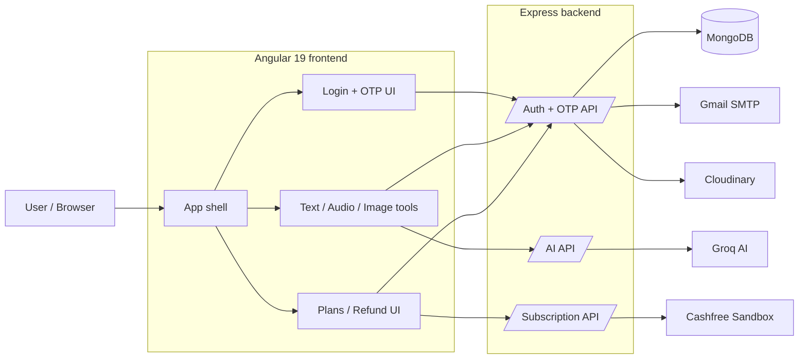
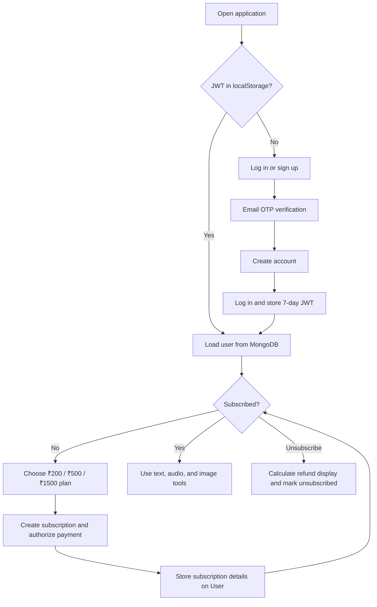
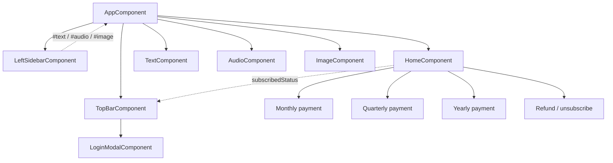
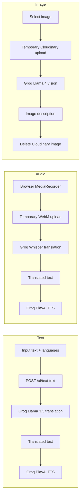
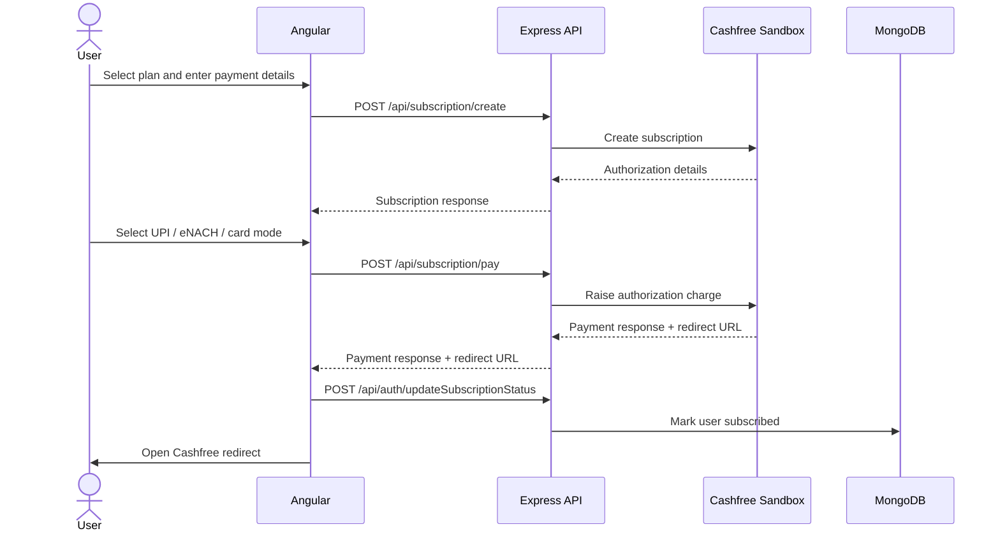
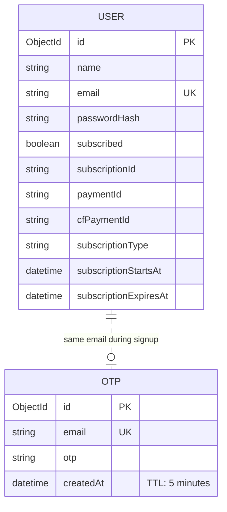
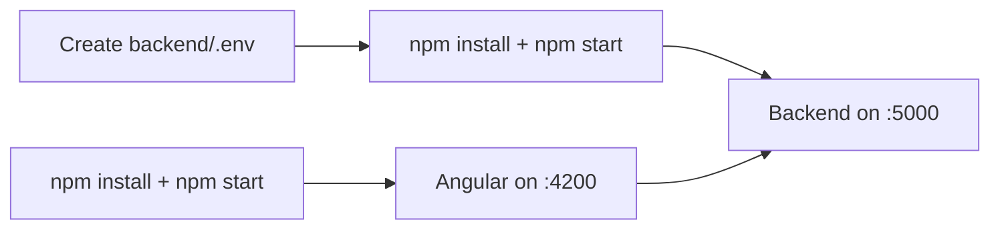
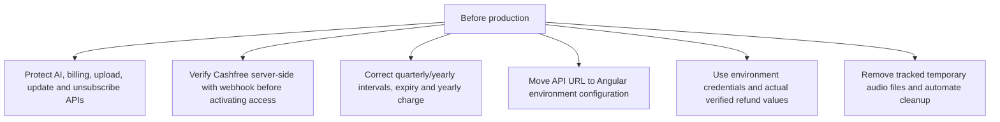

# AI Translation & Image Analysis Platform

An Angular 19 + Express application for subscriber-only text translation, speech translation, text-to-speech, image analysis, and Cashfree Sandbox subscriptions.

> [Working demo video](https://drive.google.com/file/d/1IH2008CVZ6tj2KDCoMRpZgcPchyR0jQv/view)

## System map



## User journey



The UI performs the subscription gate. The backend AI endpoints themselves currently have no JWT/subscription middleware.

## Frontend composition



Angular routes are empty. `AppComponent` reads hash-anchor navigation and conditionally displays standalone components.

## AI pipelines



## Subscription sequence



| UI plan | Displayed charge | Intended duration | Current stored expiry |
|---|---:|---|---|
| Monthly | ₹200 | 1 month | +1 month |
| Quarterly | ₹500 | 3 months | +1 month |
| Yearly | ₹1500 | 1 year | +1 month |

## Data model



## API surface

| Group | Endpoints | Purpose |
|---|---|---|
| Auth | `POST /signup`, `/login`, `/updateSubscriptionStatus`, `/unsubscribe/:id`, `/upload-image`, `/delete-image`; `GET /user-info`, `/me` | Accounts, JWT lookup, subscription state, temporary images |
| OTP | `POST /request-otp`, `/verify-otp`, `/send-otp-mail` | Five-minute email OTP flow |
| AI | `POST /text-text`, `/text-speech`, `/audio-translate`, `/analyse-image` | Groq translation, speech, and vision proxy |
| Subscription | `POST /create`, `/create-plan`, `/manage/:id`, `/payment-methods`, `/pay`, `/simulate-payment`, `/refund`; `GET /subscription-info/:id`, `/simulate/:id`, `/payment/:subscriptionId/:paymentId` | Cashfree Sandbox proxy |

All paths above are mounted below `/api/{group}`.

## Repository map

```text
cashfree-ai-new-final/
├── angular_front/
│   ├── src/app/components/    # UI, AI tools, auth, plans and refund
│   ├── src/app/app.component  # Hash-driven application shell
│   └── src/server.ts          # Angular SSR Express host
└── backend/
    ├── controllers/           # Auth, OTP, AI and Cashfree orchestration
    ├── routes/                # Express endpoint definitions
    ├── models/                # MongoDB User and OTP schemas
    ├── middleware/            # JWT verifier
    ├── utils/                 # Manual subscription-expiry updater
    └── server.js              # Backend entry point
```

## Local setup



`backend/.env`:

```dotenv
PORT=5000
MONGODB_URI=
JWT_SECRET=
GROQ_API_KEY=
CLOUDINARY_CLOUD_NAME=
CLOUDINARY_API_KEY=
CLOUDINARY_API_SECRET=
EMAIL_USER=
EMAIL_PASS=
CASHFREE_API_VERSION=
CASHFREE_CLIENT_ID=
CASHFREE_CLIENT_SECRET=
```

Run in two terminals:

```bash
cd backend
npm install
npm start
```

```bash
cd angular_front
npm install
npm start
```

Open `http://localhost:4200`. The frontend has `http://localhost:5000` embedded as its API base URL, so the backend must use `PORT=5000`. The Angular SSR build can instead be served with `npm run serve:ssr:angular_front` after a build.

## Current implementation notes



| Area | Current code behavior |
|---|---|
| Authorization | Only `GET /api/auth/me` uses `verifyToken`; most mutation and AI routes are public. |
| Protected user lookup | `/me` reads `req.user.userId`, while login signs the JWT with `id`; `/user-info` is the path used by the frontend. |
| Payment trust | The browser marks the user subscribed when a payment response contains a redirect URL; no webhook verification is implemented. |
| Plans | Quarterly is configured as a one-month interval; all plans store a one-month expiry; yearly raises `amount = 200` despite displaying ₹1500. |
| Refund | The backend refund handler contains placeholder client credentials; the UI sends `refundAmount: 0` and unsubscribe does not invoke the refund function. |
| Startup | `server.js` configures Cloudinary before its own `dotenv.config()` call and currently relies on `db.js` loading the environment as an import side effect. |
| Expiry | `utils/checkSubscriptions.js` can clear expired subscriptions, but it is a manual script and is not scheduled by the server. |
| Testing | Angular has generated component smoke tests; the backend test script is a placeholder. |
