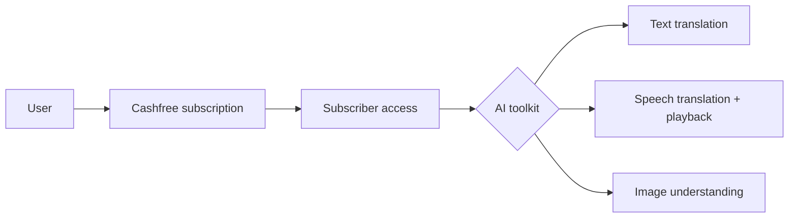
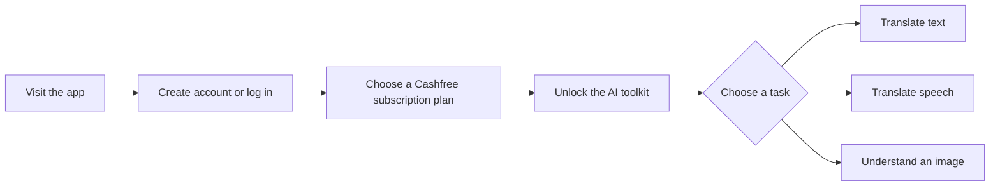
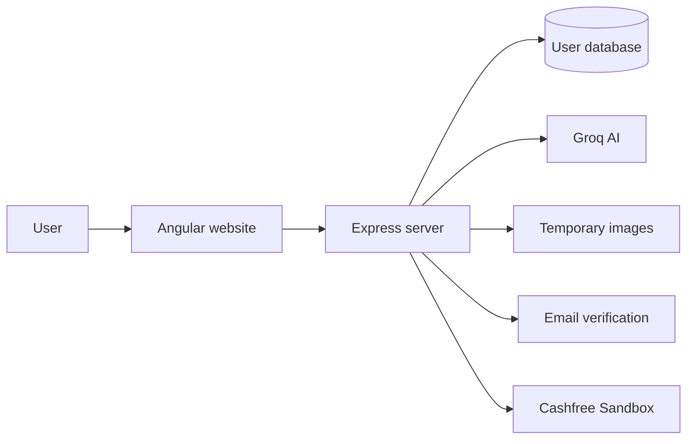

# AI Translation & Image Analysis Platform

An all-in-one AI assistant that helps people translate text and speech, listen to translated content, and understand images. Access is managed through Cashfree subscription plans.

> This repository is a working demonstration project. Payments use the Cashfree Sandbox, so it is not currently a production payment service.

## 1. The core idea

The project combines its two main selling points into one experience:

| 🧠 AI-powered experience | 💳 Cashfree payment gateway |
|---|---|
| Translates written text between languages | Offers monthly, quarterly, and yearly plans |
| Converts translated text into natural speech | Creates and manages subscription payments |
| Translates recorded voice into text | Supports UPI, eNACH, and card-related payment flows |
| Examines an uploaded image and explains its contents | Connects the payment flow with subscriber access |



**Cashfree handles the subscription flow, and the AI toolkit delivers the subscriber experience.**

## 2. How someone uses it



1. The user creates an account using email verification or logs in.
2. The user selects a subscription plan and completes the Cashfree payment flow.
3. Subscriber access unlocks the AI tools.
4. The user chooses text, speech, or image assistance.

## 3. What the AI toolkit provides

| Feature | In simple words |
|---|---|
| Text translation | Enter text, choose languages, and receive a translation. |
| Read translations aloud | Listen to translated text as generated speech. |
| Speech translation | Record your voice and receive translated text. |
| Image understanding | Upload an image and receive an AI-generated description. |

## 4. Who is it for?

- People communicating across different languages
- Students and professionals working with multilingual content
- Anyone who prefers listening instead of reading
- Users who want a quick explanation of an image
- Developers exploring AI services and subscription payments in one project

## 5. See it in action

▶️ [Watch the working demo video](https://drive.google.com/file/d/1IH2008CVZ6tj2KDCoMRpZgcPchyR0jQv/view)

## 6. Explore the documentation

| Guide | Contains |
|---|---|
| [Architecture](docs/architecture.md) | System, frontend components, repository map |
| [User and AI flows](docs/user-flows.md) | Login, subscription gate, text, audio and image flows |
| [Subscriptions](docs/subscriptions.md) | Cashfree payment sequence and plans |
| [API and data](docs/api-and-data.md) | Express endpoints and MongoDB models |
| [Local setup](docs/setup.md) | Environment variables and run commands |
| [Current implementation](docs/current-implementation.md) | Known gaps before production |

## 7. How it works behind the scenes



The website sends each request to its server. The server coordinates accounts, AI services, temporary image storage, email verification, and demonstration payments.

## 8. Quick start for developers

```bash
# Terminal 1
cd backend && npm install && npm start

# Terminal 2
cd angular_front && npm install && npm start
```

Open `http://localhost:4200`. The frontend expects the backend on `http://localhost:5000`. See [Local setup](docs/setup.md) for the required `.env` values.
