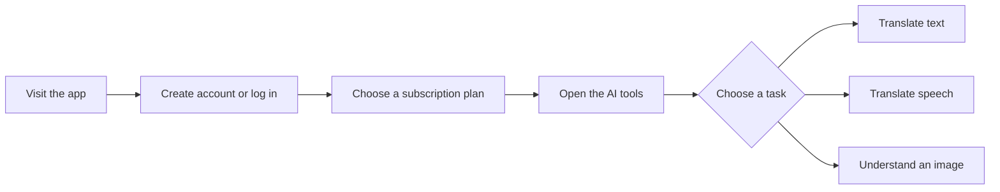
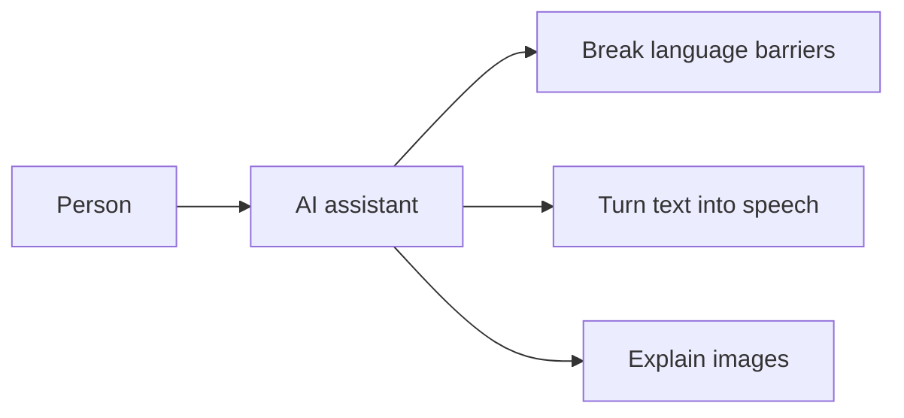
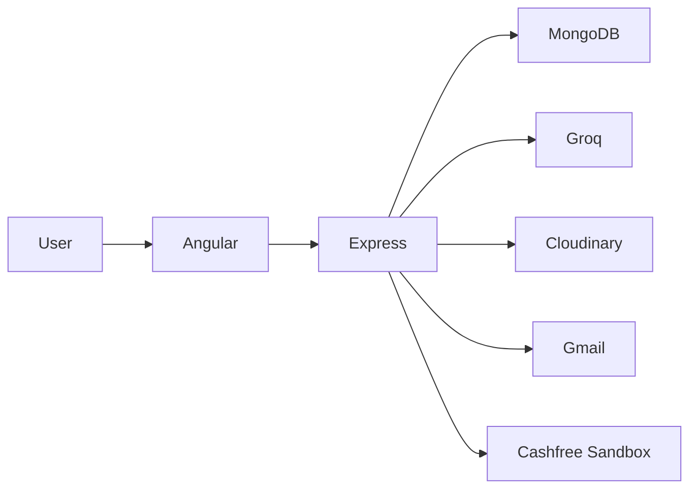

# AI Translation & Image Analysis Platform

An all-in-one AI assistant that helps people translate text and speech, listen to translated content, and understand images. Access is managed through simple subscription plans.

> This repository is a working demonstration project. Payments use the Cashfree Sandbox, so it is not currently a production payment service.

## What can it do?

| Feature | In simple words |
|---|---|
| Text translation | Enter text, choose languages, and receive a translation. |
| Read translations aloud | Listen to translated text as generated speech. |
| Speech translation | Record your voice and receive translated text. |
| Image understanding | Upload an image and receive an AI-generated description. |
| Account access | Sign up securely using an email verification code. |
| Subscriptions | Choose a monthly, quarterly, or yearly demonstration plan. |

## How someone uses it



## Who is it for?

- People communicating across different languages
- Students and professionals working with multilingual content
- Anyone who prefers listening instead of reading
- Users who want a quick explanation of an image
- Developers exploring AI services and subscription payments in one project

## The idea in one picture



The application brings these tools into one account instead of making the user switch between several services.

## Documentation

| Guide | Contains |
|---|---|
| [Architecture](docs/architecture.md) | System, frontend components, repository map |
| [User and AI flows](docs/user-flows.md) | Login, subscription gate, text, audio and image flows |
| [Subscriptions](docs/subscriptions.md) | Cashfree payment sequence and plans |
| [API and data](docs/api-and-data.md) | Express endpoints and MongoDB models |
| [Local setup](docs/setup.md) | Environment variables and run commands |
| [Current implementation](docs/current-implementation.md) | Known gaps before production |

## How it works behind the scenes



The website sends each request to its server. The server coordinates the user database, AI services, temporary image storage, email verification, and demonstration payments.

> [Working demo video](https://drive.google.com/file/d/1IH2008CVZ6tj2KDCoMRpZgcPchyR0jQv/view)

## Quick start

```bash
# Terminal 1
cd backend && npm install && npm start

# Terminal 2
cd angular_front && npm install && npm start
```

The frontend expects Angular on `:4200` and the backend on `:5000`. See [Local setup](docs/setup.md) for the required `.env` values.
