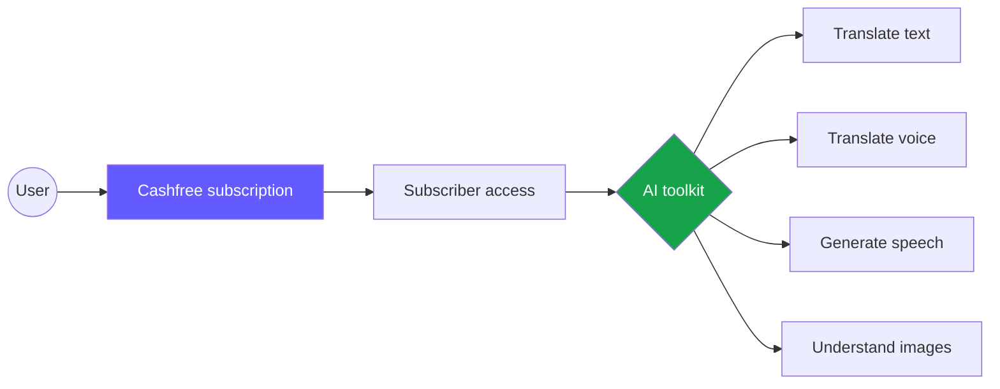
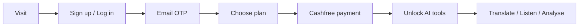
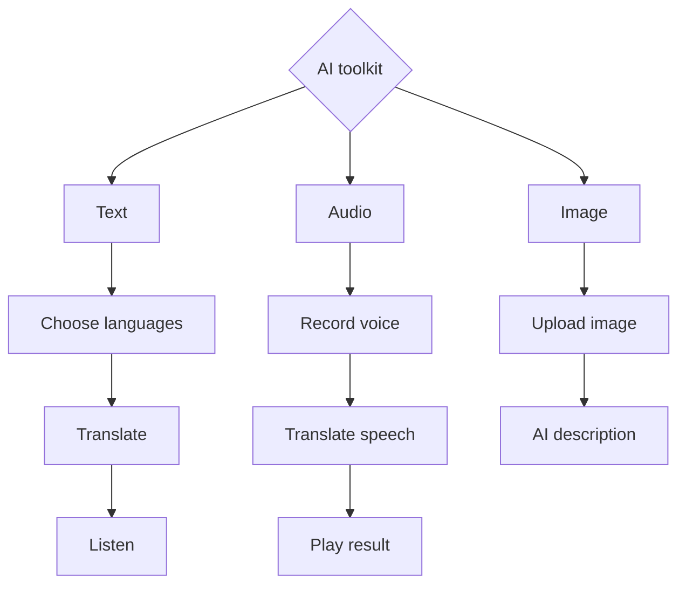
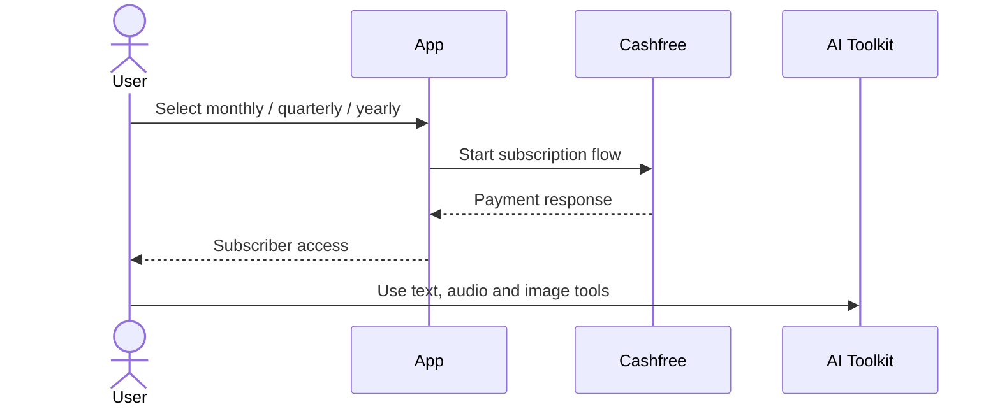
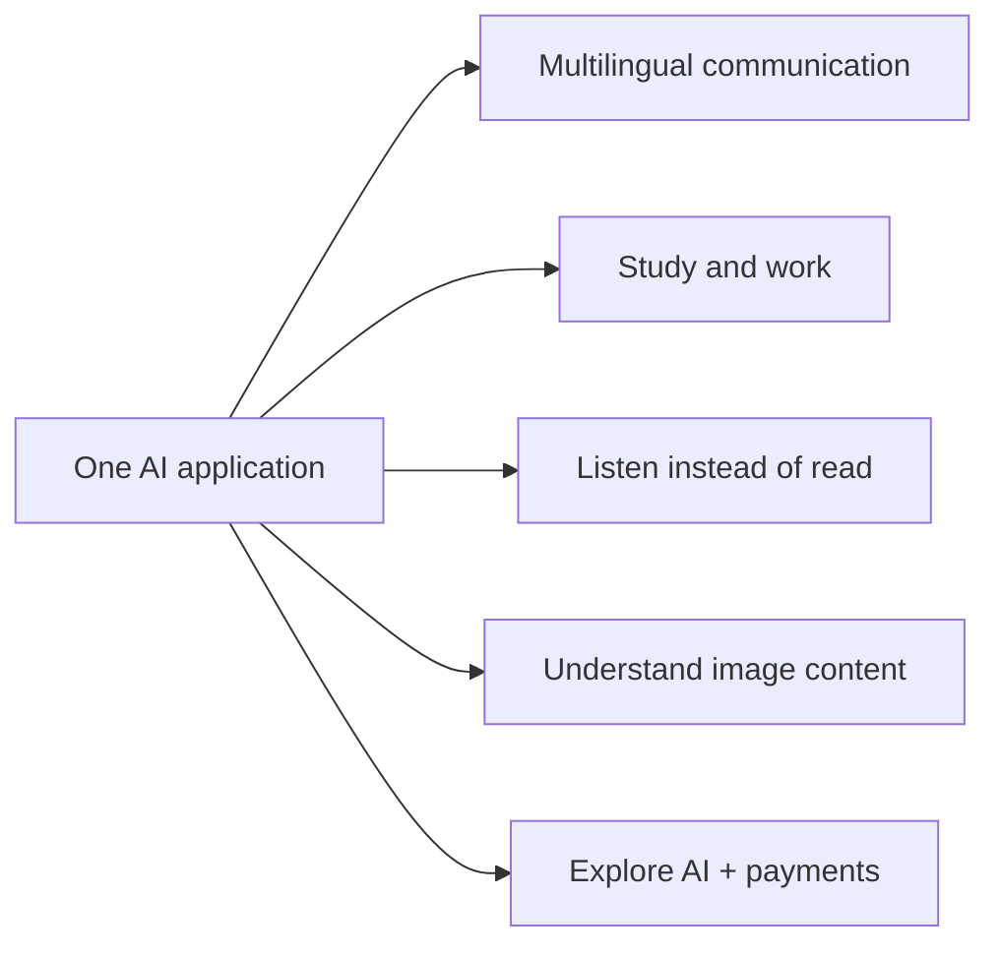
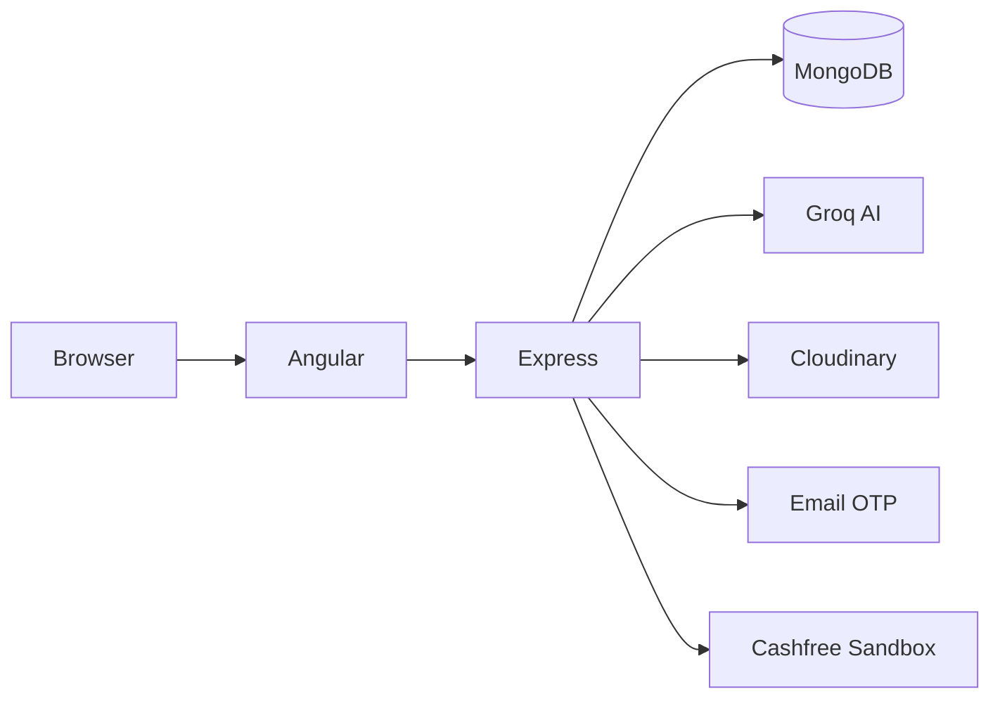

# AI Translation & Image Analysis Platform

**Cashfree-powered subscriptions unlock a single toolkit for AI translation, speech, and image understanding.**

> Demo project · Cashfree Sandbox · Not production payments

## The product



## User journey



## AI toolkit



## Subscription experience



| Monthly | Quarterly | Yearly |
|---:|---:|---:|
| ₹200 | ₹500 | ₹1500 |

## Who it helps



## See it in action

▶️ **[Watch the working demo](https://drive.google.com/file/d/1IH2008CVZ6tj2KDCoMRpZgcPchyR0jQv/view)**

## Documentation map

| Start here | Go deeper |
|---|---|
| [Architecture](docs/architecture.md) | [API and data](docs/api-and-data.md) |
| [User and AI flows](docs/user-flows.md) | [Local setup](docs/setup.md) |
| [Subscriptions](docs/subscriptions.md) | [Current implementation](docs/current-implementation.md) |

## Behind the scenes



## Run locally

```bash
cd backend
npm install
npm start
```

```bash
cd angular_front
npm install
npm start
```

Open `http://localhost:4200`; the API is expected on `http://localhost:5000`. See [Local setup](docs/setup.md) for `.env` configuration.
