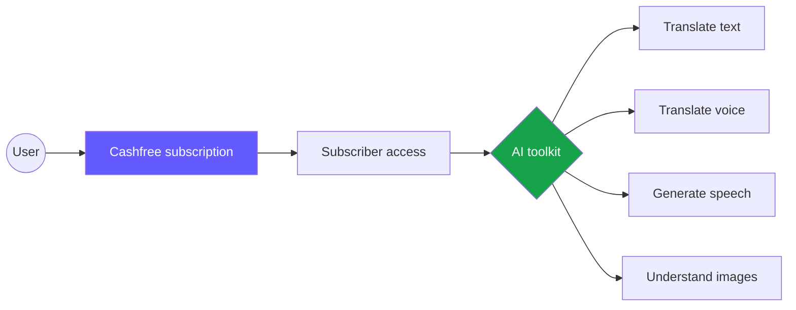
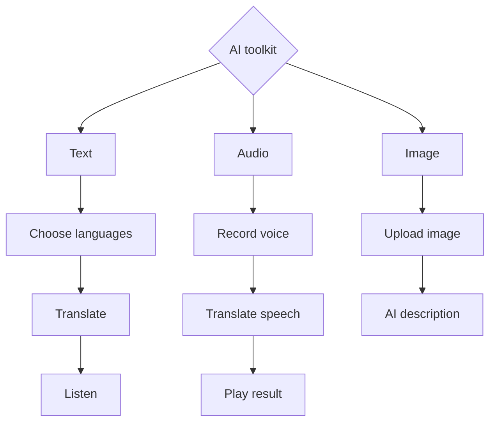
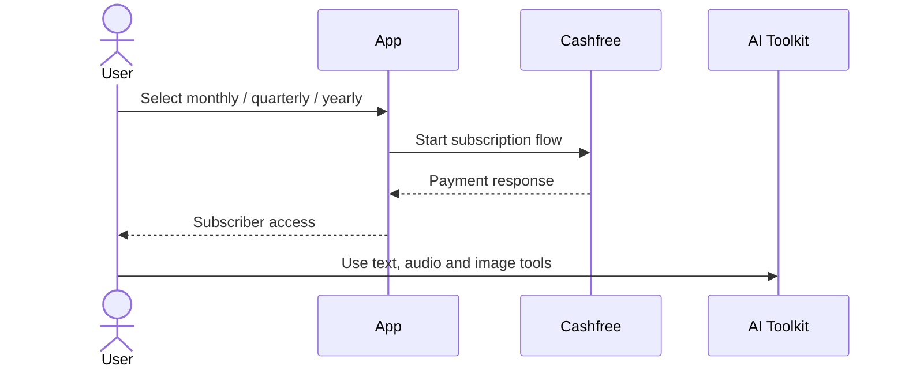
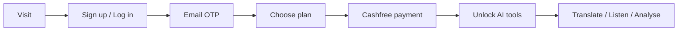
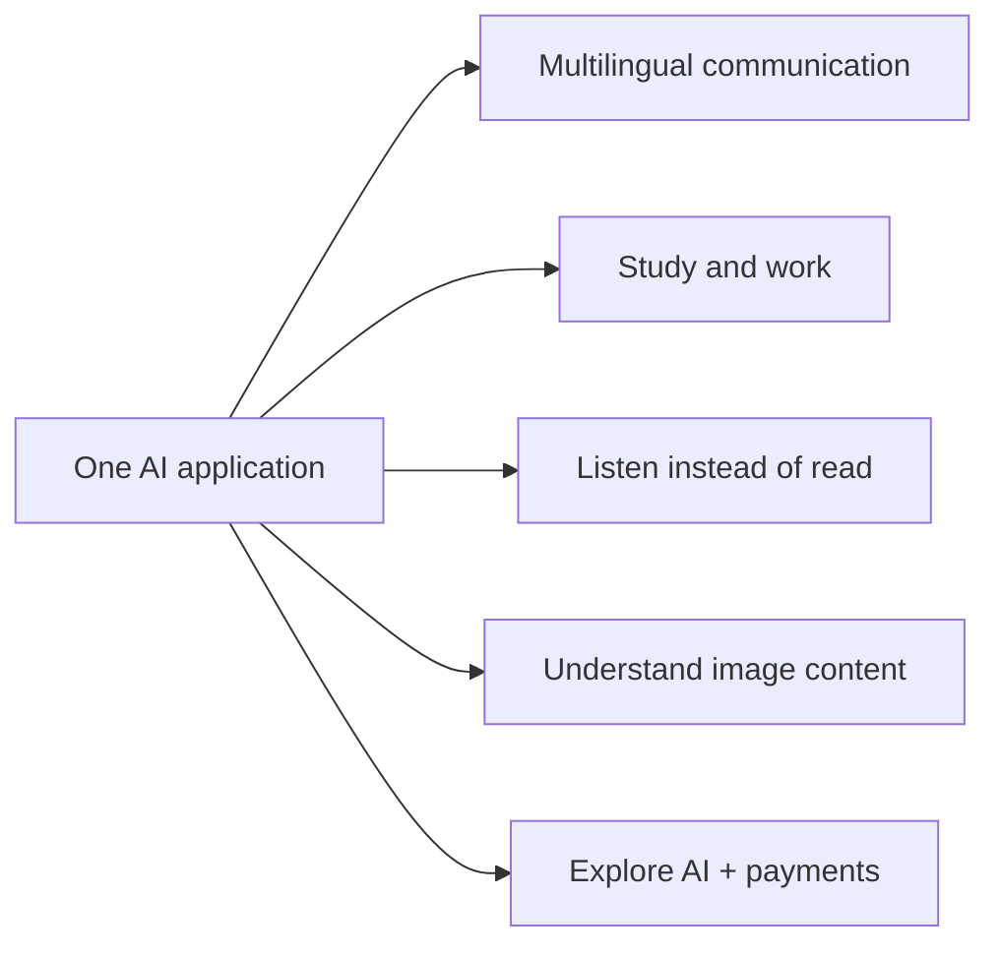
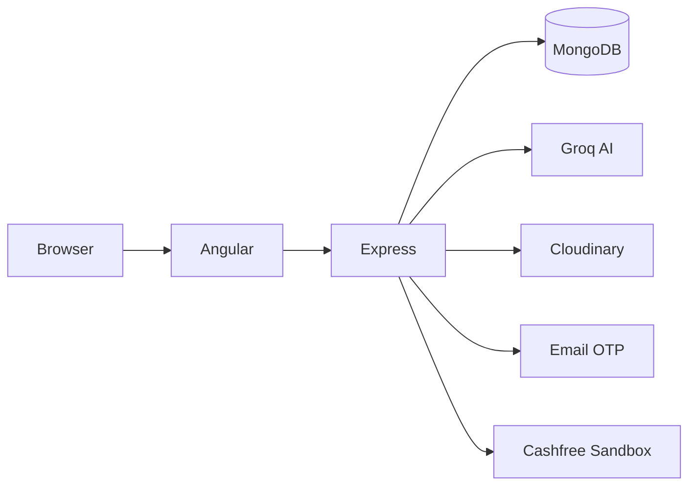

# AI Translation & Image Analysis Platform

**Cashfree-powered subscriptions unlock a single toolkit for AI translation, speech, and image understanding.**

The platform demonstrates how useful AI services can be packaged as a subscription product. Users manage access through Cashfree and then use all supported AI tools from one account.

> Demo project · Cashfree Sandbox · Not production payments

## The product

The project has two connected parts: Cashfree provides the subscription journey, while the AI toolkit provides the value users receive after subscribing.



This connection between **paid access** and **practical AI features** is the central idea of the project.

## AI toolkit

The toolkit supports three everyday input types—written text, recorded voice, and images—without requiring the user to switch applications.



- **Text:** translate between selected languages and hear the result.
- **Audio:** record speech, convert it to translated text, and play it aloud.
- **Image:** upload a picture and receive an AI-generated explanation.

## Subscription experience

Cashfree Sandbox is used to demonstrate recurring-plan creation and payment authorization. The current plans are presented as follows:



| Monthly | Quarterly | Yearly |
|---:|---:|---:|
| ₹200 | ₹500 | ₹1500 |

The application connects the subscription response with the user’s access status. Production payment verification is not yet implemented; see [Current implementation](docs/current-implementation.md).

## User journey

The experience is designed as one continuous path, from account verification to payment and finally to the AI tools.



Email OTP verifies new accounts. The user then chooses a plan, completes the Cashfree flow, and receives subscriber access.

## Who it helps

The concept is useful wherever language, audio accessibility, or quick visual understanding can reduce effort.



It also serves as a reference project for developers learning how AI integrations and a payment gateway can work together.

## See it in action

▶️ **[Watch the working demo](https://drive.google.com/file/d/1IH2008CVZ6tj2KDCoMRpZgcPchyR0jQv/view)**

## Behind the scenes

Angular provides the user interface, while the Express server coordinates the database and external services.



Groq powers translation, speech, and image analysis; Cloudinary temporarily hosts images; MongoDB stores users and subscription data.

## Documentation map

The README gives the product overview. These smaller guides contain the technical and implementation details:

| Start here | Go deeper |
|---|---|
| [Architecture](docs/architecture.md) | [API and data](docs/api-and-data.md) |
| [User and AI flows](docs/user-flows.md) | [Local setup](docs/setup.md) |
| [Subscriptions](docs/subscriptions.md) | [Current implementation](docs/current-implementation.md) |

## Run locally

Run the backend and frontend in separate terminals:

```bash
cd backend
npm install
npm start
```

```bash
cd angular_front
npm install
npm start
```

Open `http://localhost:4200`; the API is expected on `http://localhost:5000`. See [Local setup](docs/setup.md) for `.env` configuration.
