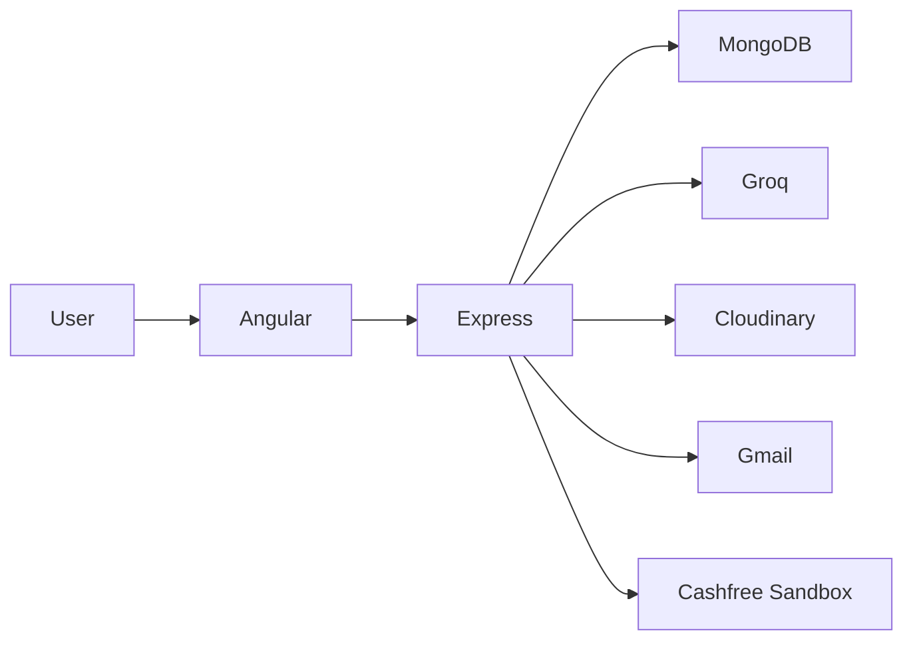

# AI Translation & Image Analysis Platform

Subscriber-only AI translation, speech, image analysis, and Cashfree Sandbox billing built with Angular 19 and Express.

## Documentation

| Guide | Contains |
|---|---|
| [Architecture](docs/architecture.md) | System, frontend components, repository map |
| [User and AI flows](docs/user-flows.md) | Login, subscription gate, text, audio and image flows |
| [Subscriptions](docs/subscriptions.md) | Cashfree payment sequence and plans |
| [API and data](docs/api-and-data.md) | Express endpoints and MongoDB models |
| [Local setup](docs/setup.md) | Environment variables and run commands |
| [Current implementation](docs/current-implementation.md) | Known gaps before production |

## Technology map



> [Working demo video](https://drive.google.com/file/d/1IH2008CVZ6tj2KDCoMRpZgcPchyR0jQv/view)

## Quick start

```bash
# Terminal 1
cd backend && npm install && npm start

# Terminal 2
cd angular_front && npm install && npm start
```

The frontend expects Angular on `:4200` and the backend on `:5000`. See [Local setup](docs/setup.md) for the required `.env` values.
