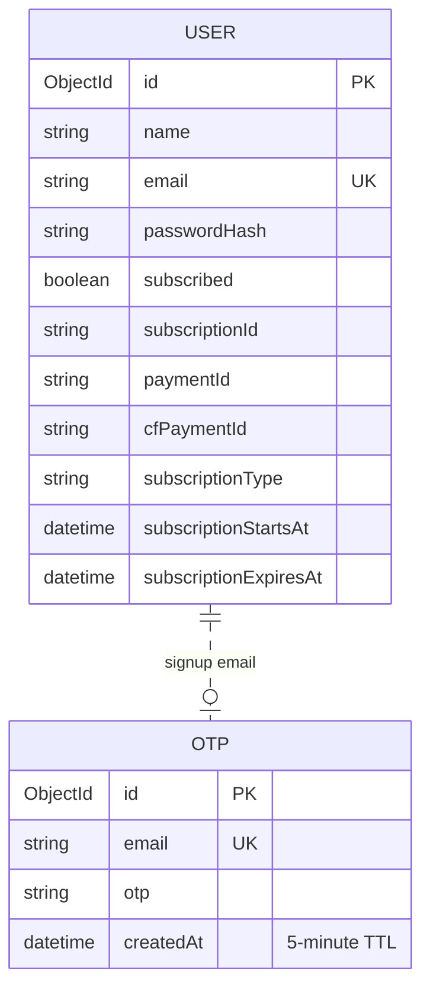

# API and data

[← Documentation home](../README.md)

## API groups

| Base path | Main endpoints | Role |
|---|---|---|
| `/api/auth` | `signup`, `login`, `user-info`, `updateSubscriptionStatus`, `unsubscribe/:id`, image upload/delete | Account and subscription state |
| `/api/otp` | `request-otp`, `verify-otp` | Five-minute email verification |
| `/api/ai` | `text-text`, `text-speech`, `audio-translate`, `analyse-image` | Groq AI proxy |
| `/api/subscription` | `create`, `pay`, `refund`, plan/manage/payment/simulation endpoints | Cashfree Sandbox proxy |

Most endpoints are `POST`; user, subscription, simulation, and payment lookups use `GET`.

## MongoDB models

Passwords use bcrypt. Login issues a seven-day JWT stored by the browser in `localStorage`.
