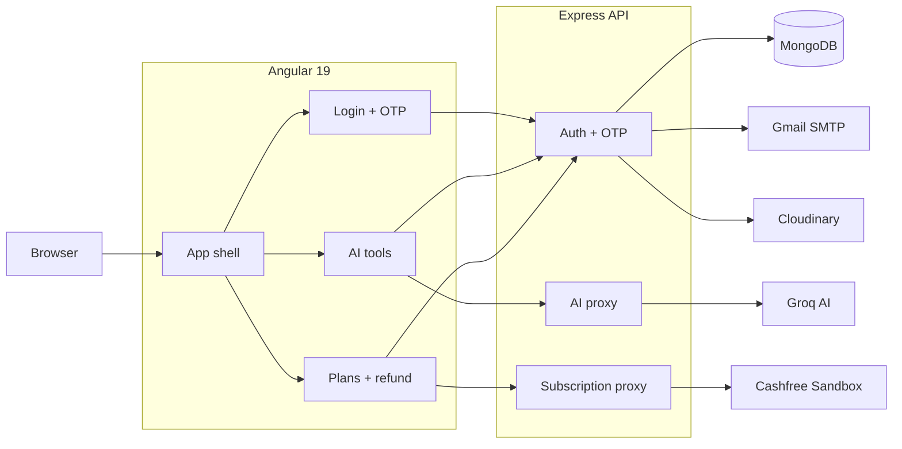
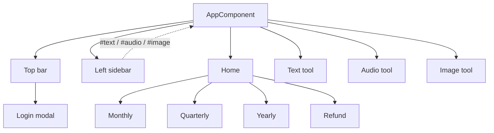

# Architecture

[← Documentation home](../README.md)

## System



## Frontend components



Angular routes are empty. The app shell reads hash anchors and conditionally shows standalone components.

## Repository

```text
cashfree-ai-new-final/
├── angular_front/
│   └── src/app/components/  # UI, AI tools, auth and payments
└── backend/
    ├── controllers/         # Business and integration logic
    ├── routes/              # Express endpoints
    ├── models/              # User and OTP schemas
    ├── middleware/          # JWT verification
    └── server.js            # API entry point
```
