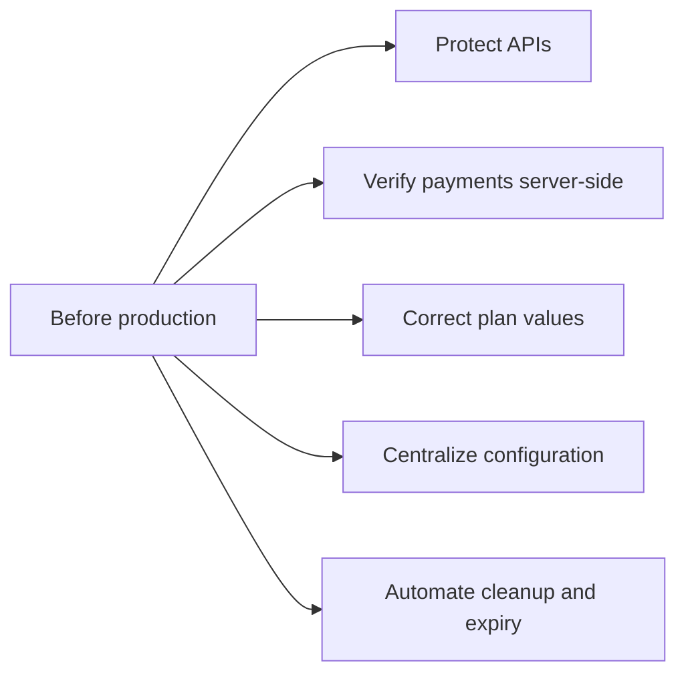

# Current implementation

[← Documentation home](../README.md)

These are documented code observations, not completed fixes.

| Area | Current behavior |
|---|---|
| Authorization | Only `/api/auth/me` uses JWT middleware; AI and most mutation routes are public. |
| User lookup | `/me` expects `userId`, but login signs the JWT with `id`; the frontend uses `/user-info`. |
| Payment trust | The browser activates a subscription from the payment response; no Cashfree webhook verification exists. |
| Plans | Quarterly uses a monthly interval; every plan stores a one-month expiry; yearly raises ₹200 in its charge request. |
| Refund | The backend has placeholder credentials; the UI sends a zero refund and unsubscribe does not call refund processing. |
| Card path | The card-labelled action constructs an eNACH `debit_card` payment method. |
| Configuration | Frontend API URLs are repeated and hardcoded. Cloudinary setup relies on dotenv loading through another imported module. |
| Expiry | `utils/checkSubscriptions.js` clears expired subscriptions only when run manually. |
| Files | Temporary audio files are present in the repository; cleanup after failed processing is not guaranteed. |
| Tests | Frontend tests are generated smoke tests; the backend has no implemented test suite. |
