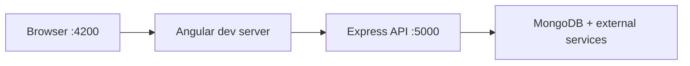

# Local setup

[← Documentation home](../README.md)

## Runtime



## Backend environment

Create `backend/.env`:

```dotenv
PORT=5000
MONGODB_URI=
JWT_SECRET=
GROQ_API_KEY=
CLOUDINARY_CLOUD_NAME=
CLOUDINARY_API_KEY=
CLOUDINARY_API_SECRET=
EMAIL_USER=
EMAIL_PASS=
CASHFREE_API_VERSION=
CASHFREE_CLIENT_ID=
CASHFREE_CLIENT_SECRET=
```

## Run

```bash
cd backend
npm install
npm start
```

```bash
cd angular_front
npm install
npm start
```

Open `http://localhost:4200`. The API URL is currently hardcoded as `http://localhost:5000` in frontend components.

For Angular SSR, build first and run `npm run serve:ssr:angular_front`; its server defaults to port `4000`.
