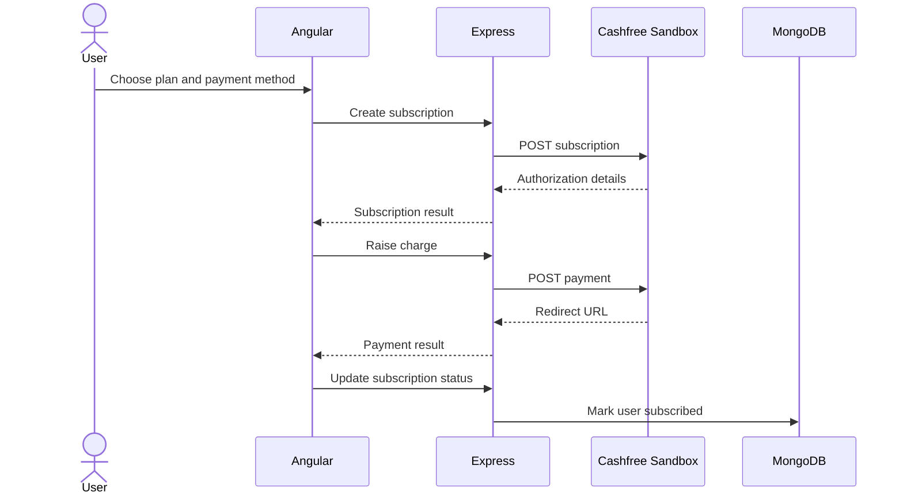

# Subscriptions

[← Documentation home](../README.md)

## Payment flow

The UI supports UPI, eNACH, and a card-labelled path. Cashfree calls use Sandbox endpoints.

## Plans

| Plan | Display | Intended term | Current stored expiry |
|---|---:|---|---|
| Monthly | ₹200 | 1 month | +1 month |
| Quarterly | ₹500 | 3 months | +1 month |
| Yearly | ₹1500 | 1 year | +1 month |

The plan components share almost identical logic. See [Current implementation](current-implementation.md) for mismatches.
