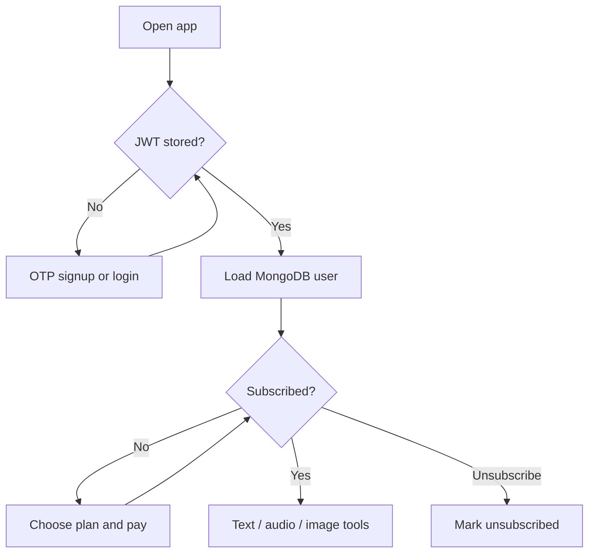
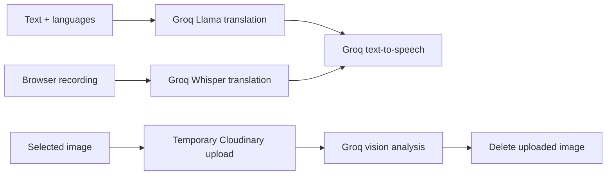

# User and AI flows

[← Documentation home](../README.md)

## Access flow

The frontend performs the subscription gate. AI endpoints are not protected by subscription middleware.

## AI flows

| Tool | Input | Output |
|---|---|---|
| Text | Text and language pair | Translation and optional speech |
| Audio | Browser WebM recording | Translated text and optional speech |
| Image | Uploaded image | Text description |
